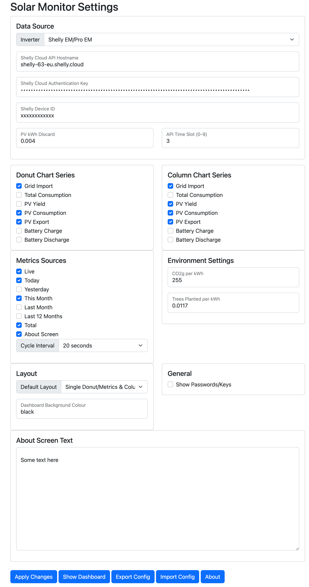
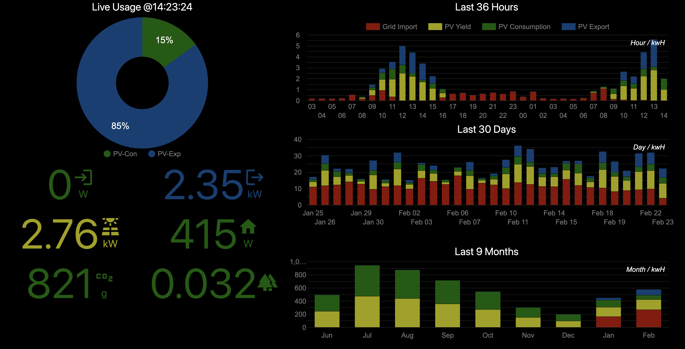
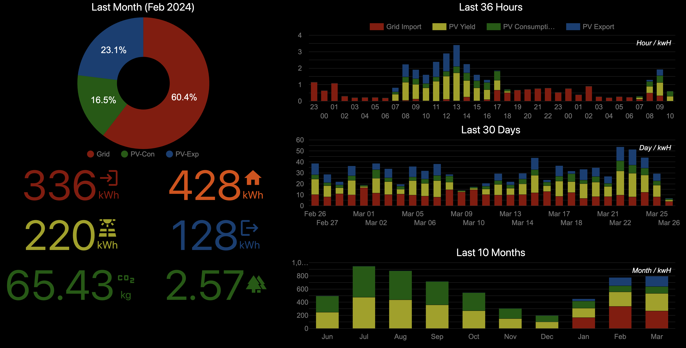
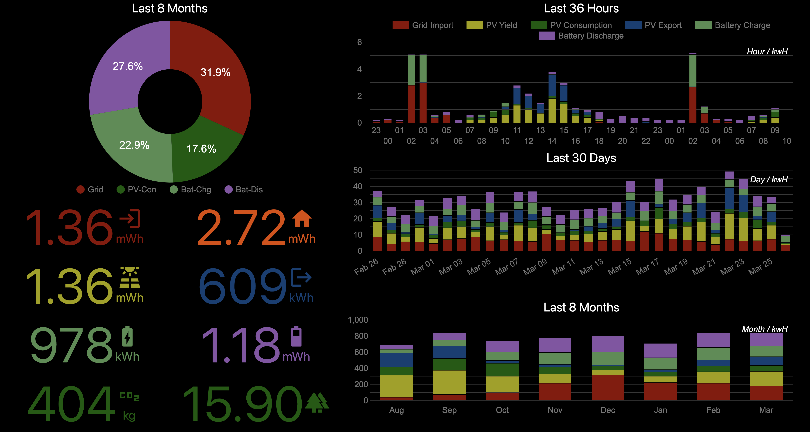
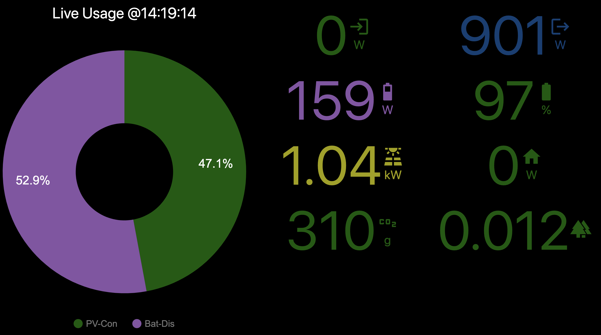
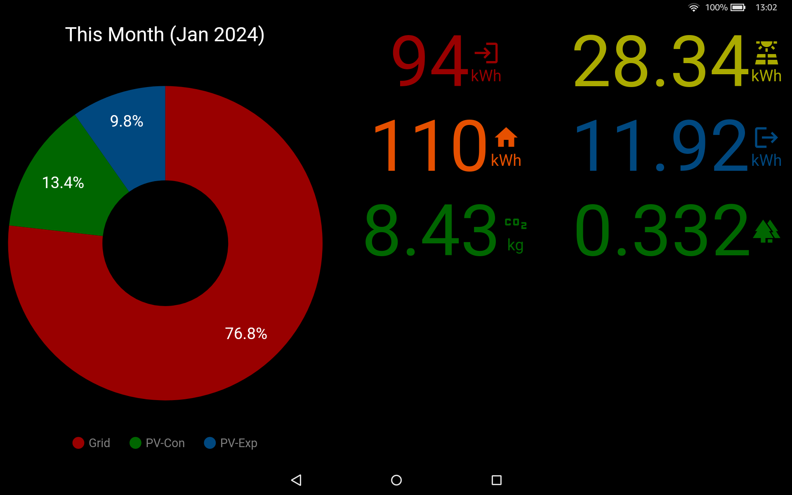
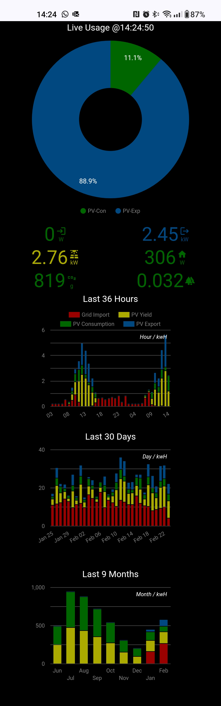

# Solar Monitor

This is a small web server designed to query live data from the likes of a Shelly EM or inverter cloud API and present it on a reactive web page that could be displayed on a monitor, TV or tablet screen. 

## Requirements:
* Computer capable of running Python3 (Any Linux, Mac or PC can do this but you may need to install Python3 and/or additional modules)
* Either:
    - A Shelly EM installed and wired with 2 CT clamps: 1:Mains import (positive import, negative export) and 2:Inverter output (positive solar generation)
    - A Solis string or hybrid inverter with cloud API access enabled (you need to issue a support ticket to Solis to enable this access)
* The script runs as a small web server and you configure the details for your Shelly EM or Solis inverter
* If all goes to plan, you will get a nice dashboard that shows you live(ish) import and export and historical data from your inverter/monitor cloud API

## Basic steps to test
* git clone https://github.com/dresdner353/energyutils.git (or download the Zip file)
* For typical Windows/Mac/Linux: pip3 install requests python-dateutil cherrypy
* For Raspberry Pi: sudo apt install python3-requests python3-dateutil python3-cherrypy3

To run:
* python3 energyutils/solar_monitor/solar_monitor.py 

Notes:
* The script will startup and create a default config.json file in energyutils/solar_monitor
* point your browser at http://localhost:8090 and you should see a blank black page displayed
* Browse to http://localhost:8090/admin to bring up the admin page (when prompted, login as user "admin" and password "123456789")
* Select the inverter/data source type and go from there inputing the credentials or your given device. 
   - Note: The inverter sources list Sofar and Huawei but only Shelly EM and Solis are supported for now.
* When ready to save, click the apply button
* If the Shelly or inverter credentials are correct, then actual usage data should soon appear on the main dashboard.
* For now, only Shelly EM and Solis inverters are supported. Others such as Sofar, Huawei etc will be added over time


## Install steps for a Raspberry pi kiosk
If you have a raspberry pi that has a recent image installed, then these steps will download an install script and install everything automatically. 

Login as pi to the rpi and open a terminal, running the following command:
```
 curl -s https://raw.githubusercontent.com/dresdner353/energyutils/master/solar_monitor/rpi_install.sh | sudo bash
```

This step will do the following:
* Install python3 modules "requests", "dateutil" and "cherrypy" 
* download the code to the home directory of user "pi"
* Set up a systemctl service called solar_monitor to auto start the service on boot
* Copy a kiosk shell script into ~/.config/autostart which starts chromium bowser on login and points to the http://localhost:8090 page

The idea here is to use the rpi as a kiosk. You would also need to configure the pi to auto-login as user pi everytime it boots and the end result should be a functioning kiosk that shows the dashboard
 
## Sample Screenshots

### Admin Page


### Large Screen Format (HD/4K monitor/TV)
The layout here uses a donut chart on the left that graphs a metric set. Underneath the donut, you will find the various metric values in numeric format. The units used will auto-scale between W/kW/mW or Wh/kWh/mWh as required.

Then on the right are three column charts that graph the recent performance for the last 36 hours, last 30 days and last 12 months. This layout will be used when rendering the page on a larger screen in landscape mode. Best suited for HD/4K monitors and TVs.

Every 10 seconds the donut chart and metrics will be cycled to the next metric. The specific set of metrics that get ued can be controlled from the admin page (<server ip/hostname>:8090/admin). 







### Small Screen Format (laptop/tablet)
The small screen format will be used on smaller screens such as laptops and tablets. This layout removes the column charts due to limited space and places the donut chart on the left and metric values on the right.

These metrics will cycle every 10 seconds from one set to the other. 





### Portrait Screen Format (portrait tablet/phone)
The portrait format will apply for any portrait monitor where the height > width and this includes mobile phones etc. All charts and metrics are shown in thos format and can be scrolled as required. If using a tablet in landscape mode, then rotating it to portrait should result in this portrait mode being activated. When rotated back to landscape, the small screen layout will resume.


