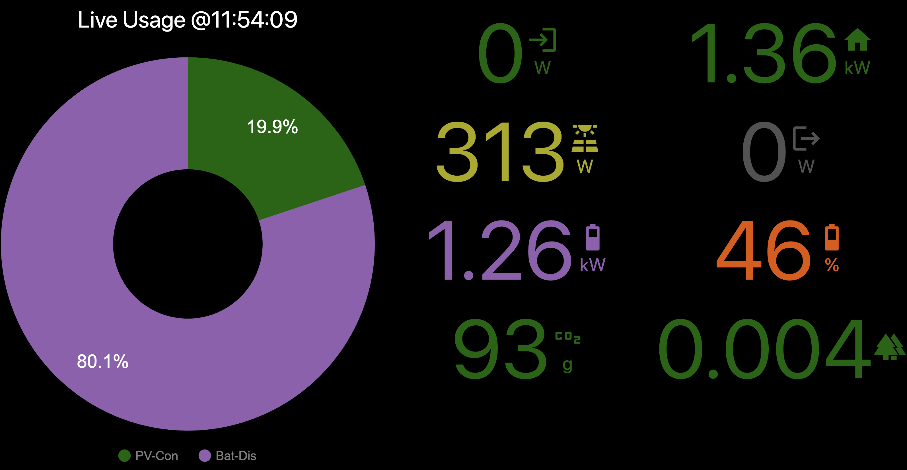
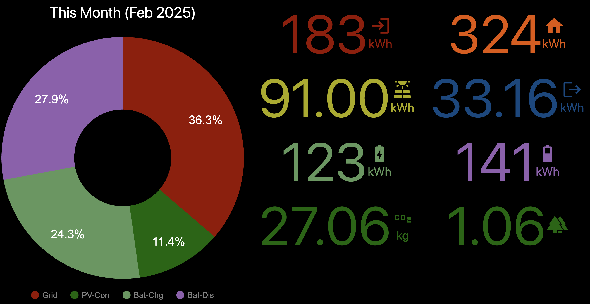

# SolarMon (Solar Monitor)

This is a small web server designed to query live data from an inverter cloud API and present it on a reactive web page that could be displayed on a monitor, TV or tablet screen. The script runs as a small web server configures with the API details for your inverter. If all goes to plan, you will get a nice dashboard that shows you a combination of live and historical solar, import and export data from your inverter.

## Requirements:
* Computer capable of running Python3 (Any Linux, Mac, PC, Raspberry Pi can do this but you may need to install Python3 and additional library modules)
* Either:
    - A Solis hybrid inverter with integrated monitoring of import/export
    - A Shelly EM or EM Pro 50 with 2 CT clamps (one wired to grid, the other to any string inverter output)
    - Two Shelly 3EM Pro 3-phase devices (one set of CT clamps wired to grid, the other set to any 3-phase string inverter output)
* Cloud API support enabled for your Solis inverter and/or Shelly devices depending on your setup

## Optional Requirements for Solis String Inverters
* Unlike the hybrid variants, Solis string inverters do not moninitor grid import and export
* An optional Shelly EM / EM Pro 50 can be installed and wired with 2 CT clamps to make up for this gap. 

## Basic steps to test
* git clone https://github.com/dresdner353/energyutils.git (or download the Zip file)
* For typical Windows/Mac/Linux: pip3 install requests python-dateutil cherrypy
* For Raspberry Pi: sudo apt install python3-requests python3-dateutil python3-cherrypy3

To run:
* python3 energyutils/solar_monitor/solar_monitor.py 

## Configuration
* The script will startup and create a default config.json file in energyutils/solar_monitor
* point your browser at either http://localhost:8090 or http://[IP of computer]:8090 and you should see The banner "SolarMon" displayed with a settings cog wheel
* Click the cog wheel or browse to http://localhost:8090/admin to bring up the admin page (when prompted, login as user "admin" and password "123456789")
* Select the inverter source type and go from there inputing the credentials or your given device. 
* If additionally using a Shelly EM/EM Pro for grid monitoring, then select the grid source drop-down to select the desired Shelly variant and enter the additional Shelly credententials
* Once you select the data sources, various fields will be shown that need to be populated with the related credentials.
* When ready to save, click the "Apply" button
* To get back to the dashboard, click the "Show Dashboard" button or separately browse to http://localhost:8090 or http://[IP of computer]:8090
* If the Shelly or inverter credentials are correct, then actual usage data should soon appear on the main dashboard.
* For the only native inverter support is for Solis. Other inverters may be added in the future.
* The use of a Shelly EM/EM Pro device with mains and PV clamps allows for deploying this monitor against any single-phase string inverter or micro-inverter setup
* The use of two Shelly 3EM Pro devices with mains and PV 3-phase clamps allows for deploying this monitor against any 3-phase string inverter setup
* The script outputs logging details as it runs on the console. You can add --verbose to get this logging more detailed data if need be.

## Sample Screenshots

### Admin Page
The admin page is accessed from http://localhost:8090/admin and has default user "admin" and pasword "123456789". These can be modified by manually editing the config.json file that is created in energyutils/shelly_monitor/config.json. 

This screen is used to first select the desired source/inverter variant and enter the API credentials. The same screen is used to customise the metrics sources that are cycled on the dashboard and also series fields for the donut and column charts.

When changes are made, they are applied by clicking the "Apply Changes" button. It is also possible to export and import config files from this page.

### Large Screen Format (HD/4K monitor/TV)
The layout here uses a donut chart on the left that graphs a metric set. Underneath the donut, you will find the various metric values in numeric format. The units used will auto-scale between W/kW/mW or Wh/kWh/mWh as required.

Then on the right are three column charts that graph the recent performance for the last 36 hours, last 30 days and last 12 months. This layout will be used when rendering the page on a larger screen in landscape mode. Best suited for HD/4K monitors and TVs.

Every N seconds the donut chart and metrics will be cycled to the next metric. The specific set of metrics that get used can be controlled from the admin page

### Small Screen Format (laptop/tablet)
The small screen format will be used on smaller screens such as laptops and tablets. This layout removes the column charts due to limited space and places the donut chart on the left and metric values on the right.

These metrics will cycle every N seconds from one set to the other. 

### Portrait Screen Format (portrait tablet/phone)
The portrait format will apply for any portrait monitor where the height > width and this includes mobile phones etc. All charts and metrics are shown in this format and can be scrolled as required. If using a tablet in landscape mode, then rotating it to portrait should result in this portrait mode being activated. When rotated back to landscape, the small screen layout will resume.

### Interactive Features

#### Bar Chart Metrics Panel
If you hover the mouse over any specific bar on the charts or tap this area on a tablet/phone, a panel will appear that displays specific values each displayed metric value. 

#### Manual Metrics Cycling
If you click or tap anywhere on the numeric metrics section, the metrics will immediately cycle to the next set. This is useful if you want to see a specific metric without waiting for the automatic cycling to occur.

#### Small/Large Screen Layout Cycling
If you click or tap on the donut chart, the layout will cycle between the small and large screen layouts. This is useful if want to force a specific layout to be used over the automatic layout that was first selected. 

This feature also allows for a small layout to be used with say a tablet display which is best suited for distance reading but then a single tap will quickly switch to the large layout when you are standing closer to the screen.
